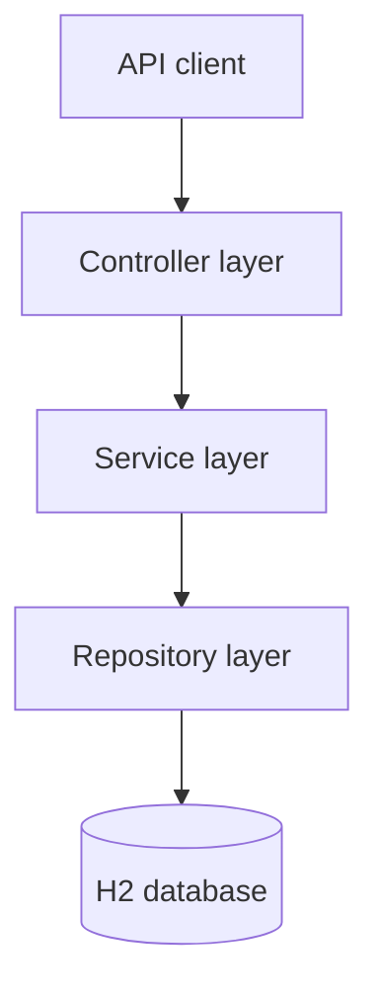
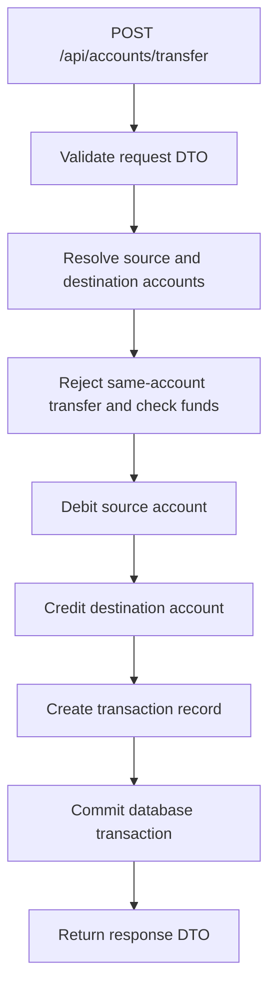

# Architecture

## Layered design



| Layer | Responsibility | Components |
| --- | --- | --- |
| Controller | Receive HTTP requests, validate input, handle parameters, delegate to services, and return responses | `CustomerController`, `AccountController`, `TransactionController` |
| Service | Customer operations, account creation, balance checks, deposits, withdrawals, transfers, transaction creation, and entity-to-DTO conversion | `CustomerService`, `AccountService`, `TransactionService` |
| Repository | Database access through Spring Data JPA | `CustomerRepository`, `AccountRepository`, `TransactionRepository` |
| Entity | Represent the database model | `Customer`, `Account`, `Transaction` |
| DTO | Define request and response contracts separately from persistence entities | Request and response records/classes |
| Exception | Represent domain failures and centralize HTTP error handling | Custom exceptions and `GlobalExceptionHandler` |

## Domain model

### Customer

A customer contains an ID, name, email, and phone number. One customer can own multiple accounts.

```text
Customer 1 ─────────── * Account
```

### Account

An account contains:

- Internal database ID.
- Automatically generated unique account number, for example `ACC8F4A21C9D0`.
- Account type: `SAVINGS` or `CURRENT`.
- Balance.
- Account status: `ACTIVE`, `BLOCKED`, or `CLOSED`. Creation sets `ACTIVE`; deposits, withdrawals, and transfers currently do not check status.
- Associated customer.
- Optimistic locking version.

### Transaction

Every successful financial operation creates a transaction record containing:

- Internal transaction ID and a separate transaction reference.
- Type: `DEPOSIT`, `WITHDRAWAL`, or `TRANSFER`.
- Amount.
- Source account (`fromAccount`) and destination account (`toAccount`).
- Status, currently `SUCCESS`.
- Creation timestamp.

An account can participate as the source or destination of many transactions:

| Operation | `fromAccount` | `toAccount` |
| --- | --- | --- |
| Deposit | `null` | Receiving account |
| Withdrawal | Withdrawing account | `null` |
| Transfer | Source account | Destination account |

For deposits and withdrawals, the external source or destination is represented by the absent account reference, not by a separate account entity.

The transaction entity has an internal ID, but `TransactionResponse` exposes the transaction reference instead of that ID. Both account numbers and transaction references have unique, non-null column mappings.

## Transfer request flow



The balance updates and transaction record belong to one database transaction. Failures subject to the transaction's rollback rules prevent partial changes from being committed.

## DTOs

- `UpdateCustomerRequest`
- `CreateAccountRequest`
- `AccountResponse`
- `DepositRequest`
- `WithdrawRequest`
- `TransferRequest`
- `TransferResponse`
- `TransactionResponse`

Account responses use `AccountResponse`, and transaction history uses `TransactionResponse`. Customer endpoints currently return the `Customer` entity; customer POST and PUT also accept that entity directly. Customer PATCH accepts `UpdateCustomerRequest`. Full customer DTO separation is planned.

## Exceptions

- `CustomerAlreadyExistsException`
- `CustomerNotFoundException`
- `AccountNotFoundException`
- `InsufficientFundsException`
- `InvalidTransferException`

`GlobalExceptionHandler` uses `@RestControllerAdvice` to translate failures into HTTP responses, including HTTP 409 for optimistic locking conflicts.

## Project structure

```text
src/
└── main/
    └── java/
        └── com/
            └── bankingsystem/
                └── bank/
                    ├── BankApplication.java
                    ├── controller/
                    │   ├── BankController.java
                    │   ├── CustomerController.java
                    │   ├── AccountController.java
                    │   └── TransactionController.java
                    ├── service/
                    │   ├── CustomerService.java
                    │   ├── AccountService.java
                    │   └── TransactionService.java
                    ├── repository/
                    │   ├── CustomerRepository.java
                    │   ├── AccountRepository.java
                    │   └── TransactionRepository.java
                    ├── entity/
                    │   ├── Customer.java
                    │   ├── Account.java
                    │   ├── AccountType.java
                    │   ├── AccountStatus.java
                    │   ├── Transaction.java
                    │   ├── TransactionType.java
                    │   └── TransactionStatus.java
                    ├── dto/
                    │   ├── UpdateCustomerRequest.java
                    │   ├── CreateAccountRequest.java
                    │   ├── AccountResponse.java
                    │   ├── DepositRequest.java
                    │   ├── WithdrawRequest.java
                    │   ├── TransferRequest.java
                    │   ├── TransferResponse.java
                    │   └── TransactionResponse.java
                    └── exception/
                        ├── CustomerAlreadyExistsException.java
                        ├── CustomerNotFoundException.java
                        ├── AccountNotFoundException.java
                        ├── InsufficientFundsException.java
                        ├── InvalidTransferException.java
                        └── GlobalExceptionHandler.java
```
