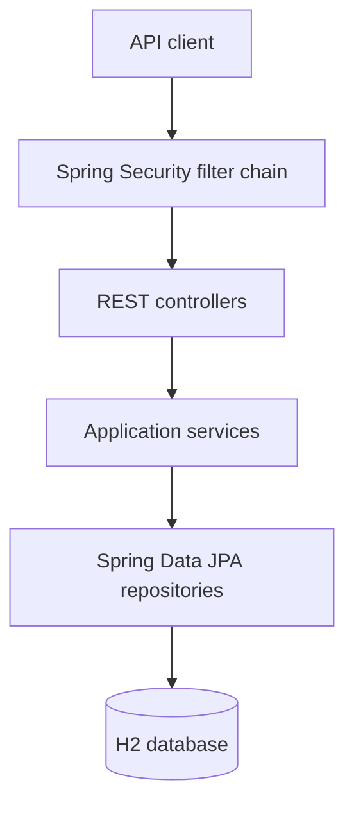
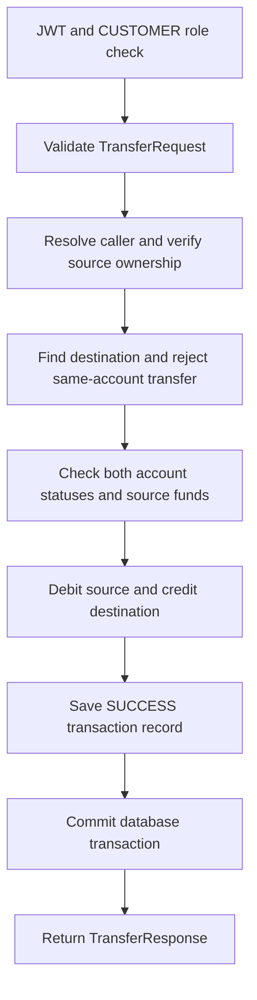

# Architecture

## Application layers


```mermaid
flowchart TD
    Client[API client] --> Security[Spring Security filter chain]
    Security --> Controller[REST controllers]
    Controller --> Service[Application services]
    Service --> Repository[Spring Data JPA repositories]
    Repository --> DB[(H2 database)]
```

| Layer | Responsibility | Components |
| --- | --- | --- |
| Configuration | Password encoder, authentication provider, security rules, JWT encoder/decoder and authority mapping | `SecurityConfig` |
| Controller | Route requests, validate DTOs, return HTTP responses | `AuthController`, `CustomerController`, `AccountController`, `AdminAccountController`, `TransactionController`, `BankController` |
| Service | Authentication, identity lookup, customer/account operations, ownership checks, financial rules, response mapping | `AuthService`, `JwtService`, `CustomUserDetailsService`, `CustomerService`, `AccountService`, `TransactionService` |
| Repository | Entity lookups, saves, uniqueness lookups, paginated transaction queries | Customer, account, transaction, and user-account repositories |
| Entity | Persistence model and relationships | `Customer`, `UserAccount`, `Account`, `Transaction` |
| DTO | API request/response records | Authentication, account, transfer, transaction, and customer PATCH records |
| Exception | Domain failures and centralized HTTP mappings | Custom runtime exceptions and `GlobalExceptionHandler` |

## Authentication and authorization

Signup atomically creates a customer and linked `UserAccount`, hashing the password with BCrypt and assigning `CUSTOMER`.

Login authenticates email/password through `AuthenticationManager`, `DaoAuthenticationProvider`, and `CustomUserDetailsService`. `JwtService` issues a token with the email as subject and a role claim such as `ROLE_CUSTOMER` or `ROLE_ADMIN`. The expiration property is interpreted in milliseconds.

The resource-server configuration validates bearer JWTs using a symmetric secret. A JWT authentication converter maps the role claim directly to a granted authority. The security chain disables CSRF and requires authentication except for `/api/auth/**`. It does not explicitly configure a stateless session-creation policy.

Endpoint role rules and service ownership checks serve different purposes. Account services resolve the authenticated email to `UserAccount` and compare linked customer IDs. The admin creation route uses a separately supplied customer ID; other ownership checks have no admin bypass.

Current ownership checks cover customer-by-ID reads, customer-account lists, individual account reads, deposits, withdrawals, and transfer sources. Customer updates/deletion and transaction-history reads do not yet perform ownership checks. See the [access table](API.md#endpoints-and-current-access-rules).

## Domain model

```text
UserAccount ── one-to-one ── Customer ── one-to-many ── Account
                                                        │
                              source or destination in many Transactions
```

`UserAccount` contains an internal ID, unique non-null login email, password hash, role, and required customer link. Direct customer creation can produce a customer without login credentials.

`Customer` contains ID, name, unique email, and international-format phone number. Its email is stored separately from the user login email.

`Account` contains ID, unique non-null account number, account type, balance, status, customer relation, and an optimistic locking `@Version`. Types are `SAVINGS` and `CURRENT`; statuses are `ACTIVE`, `BLOCKED`, and `CLOSED`.

`Transaction` contains ID, unique non-null transaction reference, type, amount, optional source/destination relations, status, and creation timestamp. Supported types are `DEPOSIT`, `WITHDRAWAL`, and `TRANSFER`; the only current status is `SUCCESS`.

| Operation | Source account | Destination account |
| --- | --- | --- |
| Deposit | null | Receiving account |
| Withdrawal | Withdrawing account | null |
| Transfer | Source account | Destination account |

External deposit/withdrawal counterparties are not separate entities. Account numbers and transaction references use `ACC` and `TXN` prefixes followed by ten uppercase hexadecimal characters derived from a UUID.

## Transfer flow


```mermaid
flowchart TD
    A[JWT and CUSTOMER role check] --> B[Validate TransferRequest]
    B --> C[Resolve caller and verify source ownership]
    C --> D[Find destination and reject same-account transfer]
    D --> E[Check both account statuses and source funds]
    E --> F[Debit source and credit destination]
    F --> G[Save SUCCESS transaction record]
    G --> H[Commit database transaction]
    H --> I[Return TransferResponse]
```

`AccountService` uses `jakarta.transaction.Transactional` for financial operations. Balance changes are persisted through managed-entity dirty checking, while the transaction record is explicitly saved. Account version checks detect conflicting concurrent updates; the exception handler maps supported optimistic locking failures to HTTP 409.

## API model boundaries

Account responses use `AccountResponse`; transfers use `TransferResponse`; history maps a repository page to `Page<TransactionResponse>`. Customer APIs still return entities, with POST/PUT accepting `Customer` and PATCH accepting `UpdateCustomerRequest`. Login returns a raw string and signup returns no body.

Request records: `SignupRequest`, `LoginRequest`, `CreateAccountRequest`, `AdminCreateAccountRequest`, `DepositRequest`, `WithdrawRequest`, `TransferRequest`, and `UpdateCustomerRequest`.

## Project structure

```text
src/
├── main/
│   ├── java/com/bankingsystem/bank/
│   │   ├── BankApplication.java
│   │   ├── config/          Security configuration
│   │   ├── controller/      Authentication, customers, accounts, admin, history, status
│   │   ├── service/         Authentication and banking business logic
│   │   ├── repository/      Customer, Account, Transaction, UserAccount repositories
│   │   ├── entity/          Domain entities and enums
│   │   ├── dto/             Request and response records
│   │   └── exception/       Domain exceptions and global handler
│   └── resources/application.properties
└── test/java/com/bankingsystem/bank/
    ├── BankApplicationTests.java
    └── service/AccountServiceTest.java
```

H2 is in memory, and Hibernate creates the schema at startup. There are no database migrations or persistent PostgreSQL configuration in the reviewed implementation.
